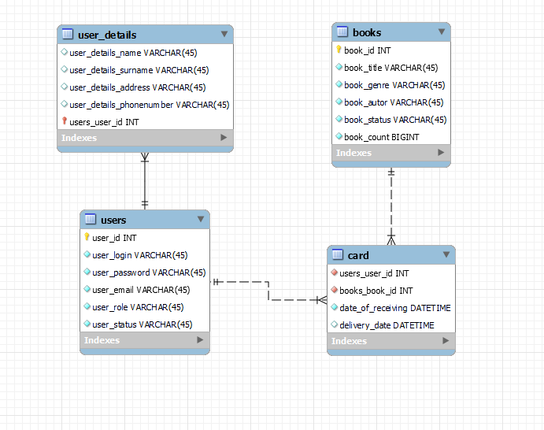

# Library
# RESTful Web-application is written using the following technologies: 
  - Gradle 
  - JDBC 
  - MySQL DB 
  - Spring Framework
### Short description of the project
Library 

### Prerequisites:
- Tomcat
- Java 11
- MySQl

# Data model
## ER diagram for the data model

## RESTful API

**1. API Description of general methods for User**

METHOD | PATH | DESCRIPTION
------------|-----|------------
POST | /api/users | register new user
PUT | /api/users/{id} | update user by id
GET | /api/users/{id} | get user by id

**2. API Description of general methods for Book**

METHOD | PATH | DESCRIPTION
------------|-----|------------
POST | /api/books | register new book
PUT | /api/books/delete/{id} | update book status = 'INACTIVE'
PUT | /api/books/{status}/{id} | update book status = 'ACTIVE'
PUT | /api/books/count/{id} | update book_count and status
GET | /api/books/ | get all books
GET | /api/books/{id} | get book by id

**3. API Description of general methods for Card**

METHOD | PATH | DESCRIPTION
------------|-----|------------
POST | /api/card | take a book
PUT | /api/card | return a book
GET | /api/card | get cards
GET | /api/card/{id} | get card by id

### My application requests in Postman
